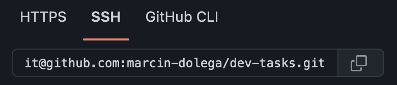

# DEV-TEST TASKS

Project is build on java 17 SDK.
You have to have maven installed for running maven commands.

# SETUP

Using git repository:

1. With ssh:

Copy SSH repository link:

    
    git@github.com:marcin-dolega/dev-tasks.git

Open terminal in target directory:

example:

    ~/Users/User/IdeaProjects/dir

Run commands in terminal:

    % cd dir
    % git clone git@github.com:marcin-dolega/dev-tasks.git

2. With zip:

Download project ZIP file from repository:

Open zip file and copy project repository to target directory.

Now you can open project in you favourite IDE.

# RUN APPLICATION

1. Go to application root folder:
2. Build jar file:

Open terminal and run command:

    % mvn clean package

This will create target directory in your root directory.

To enter target folder command:

    % cd target

Maven should create jar file for application:

    dev-tasks-1.0-SNAPSHOT.jar

3. Run application

To start application while being in /target directory run:
    
    % java -jar dev-tasks-1.0-SNAPSHOT.jar

# TASKS

After starting the application please choose task:

# Task 1

Task 1 input accepts list of integers:

example:

    1 10 20 20 2 5

This task will return a list of distinct elements of the given list, as well as number of total elements, 
number of distinct elements, min and max element.

output:

    1 2 5 10 20
    count: 6
    distinct: 5
    min: 1
    max: 20

# Task 2

Task 2 input accepts list of integers:

example:

    1 2 10 7 5 3 6 6 13 0

This task will find and return all the pairs that sums up to 13. Each pair in the output have first number < then the
second and lines of pairs are sorted in an ascending order.

output:

    0 13
    3 10
    6 7
    6 7

# Task 3

This task input contains several lines and accepts input as follows in example:

example:
    
    3
    2 3
    1 2
    5 6

The first line contains a positive number (number of following pairs of positive integers), where each pair identifies
a connection between two vertices in a graph.

Explanation:

The task input defines connection between vertices, so:

input:

    3
    1 2
    2 3
    4 5

This input means that we have 3 connections and 5 different vertices, which would visually look like:

graphs:

    [1]-[2]-[3]

    [4]-[5]

output:

    2

So, in the example there are two separated groups of connected vertices. If we would add forth connection, between 3 4
we would have only one group of vertices

input:
    
    4
    1 2
    2 3
    4 5
    3 4

graphs:

    [1]-[2]-[3]-[4]-[5]

output:

    1